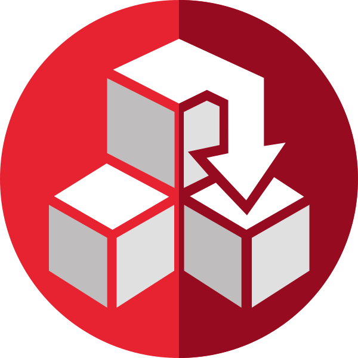

<p align="center">
  
</p>


# DelphiBlocks

> **Early preview — work in progress.**

A command-line package manager for Delphi / RAD Studio. DelphiBlocks automates downloading, compiling, and registering third-party Delphi packages sourced from a GitHub-hosted registry.

## Quick start

Install DelphiBlocks with [winget](https://learn.microsoft.com/windows/package-manager/) (as below), or download the setup from the [GitHub releases](https://github.com/delphi-blocks/blocks/releases).

```bat
REM 1. Install DelphiBlocks
winget install DelphiBlocks.Blocks

REM 2. Create a workspace in the current directory (prompts for the Delphi version)
blocks init

REM 3. Install a package
blocks install owner.package
```

To pin or restrict the version, append `@<constraint>` to the package id (e.g. `blocks install owner.package@^1.2.0`); see [docs/versioning.md](docs/versioning.md).

For the full list of commands and options, see the [command-line reference](docs/cli.md), or run `blocks help <command>`.

## How it works

1. Reads a JSON manifest from the [blocks-repository](https://github.com/delphi-blocks/blocks-repository).
2. Downloads the package source as a ZIP from GitHub.
3. Compiles it with MSBuild against the selected Delphi version.
4. Registers the library paths in the Delphi registry and records the installation in a local database (`.blocks/`).

## Features

- **Automatic Delphi detection** — discovers the installed Delphi/RAD Studio versions and their supported platforms.
- **Multiple Delphi IDE profiles** — target an alternative registry profile via the `registrykey` setting (launched with `bds.exe -r MyProfile`). Combined with separate workspaces, this lets you install different versions of the same package for the same Delphi version, each isolated in its own profile.
- **Custom repositories** — add your own GitHub-hosted repositories as package sources, alongside the default registry.
- **Versioning & dependencies** — versions and constraints follow [SemVer](https://semver.org/); Blocks resolves the best match and installs dependencies recursively. See [docs/versioning.md](docs/versioning.md).
- **Manifest scripts** — run built-in commands (e.g. copying resources) at lifecycle events such as `afterCompile` or `afterInstall`. See [docs/script.md](docs/script.md).
- **Full package management** — uninstall packages, search the repository, list the installed packages and inspect their details. See the [command-line reference](docs/cli.md).

## Requirements

- Windows 10 or 11
- Delphi / RAD Studio XE6 or later (BDS 14.0 – 37.0)
- MSBuild (bundled with RAD Studio)

## Output layout

When `blocks install` compiles a package it overrides the MSBuild output paths so that artefacts live under predictable locations.

| Artefact | Output path |
|----------|-------------|
| BPL files | `.blocks\bpl\` (release) and `.blocks\bpl\debug\` (debug) |
| DCP files | `.blocks\dcp\` (release) and `.blocks\dcp\debug\` (debug) |
| DCU files | `.blocks\lib\<name>\<Platform>\` (release) and `.blocks\lib\<name>\<Platform>\debug\` (debug), where `<name>` is the manifest's `name` |

Both **debug** and **release** configurations are built for every package. The fixed `.blocks\` location keeps installations under different IDE registry profiles (created with `bds.exe -r <key>`) isolated: each workspace gets its own `.blocks\` tree, so artefacts never collide.

## Package manifest

Each package in the repository is described by a JSON manifest file (`<vendor>.<name>.manifest.json`). It declares the package id and version, the source repository, the platforms and source paths to register, the `.dproj` packages to build, and any dependencies.

For an annotated example and a full field-by-field reference, see [docs/manifest.md](docs/manifest.md).

## Building from source

All source files are under `Source/`. **Building requires Delphi 13 or later**. The project has no external dependencies: open `Source\Blocks.dproj` in Delphi / RAD Studio and compile. The compiled executable (`Blocks.exe`) is placed in the project root.

## Acknowledgements

Thanks to [Ethea](https://ethea.it/) for providing the code-signing certificate used to sign the executables.

## License

Apache License 2.0 — see [LICENSE](LICENSE).
